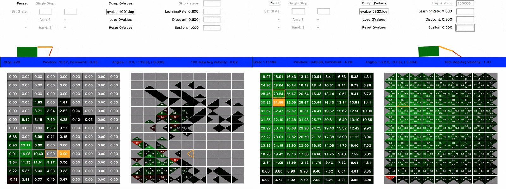

# Crawler, Q-learning
 
Visual and interactive extension of Q-learning Crawler, based on the lectures and code from [Introduction to Artificial Intelligence, UC Berkeley](http://inst.eecs.berkeley.edu/~cs188/).

The project is small and self-contained, aim to help gain an instinctual understanding of random walk, exploitation and exploration, the convergence of Q-value.

  
To train the Crawler: python crawlerMain.py.
Prerequisites: Python 3.6 (tested on Mac OS X).
